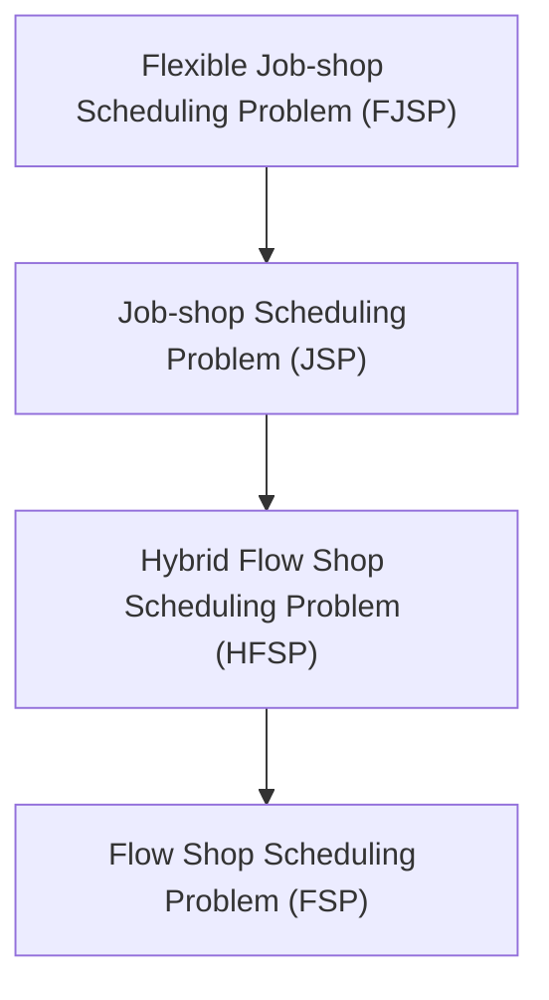
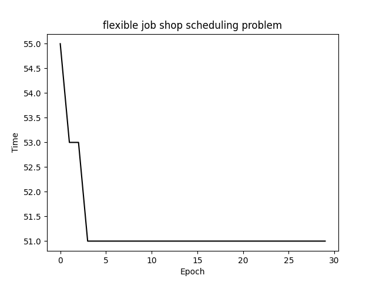
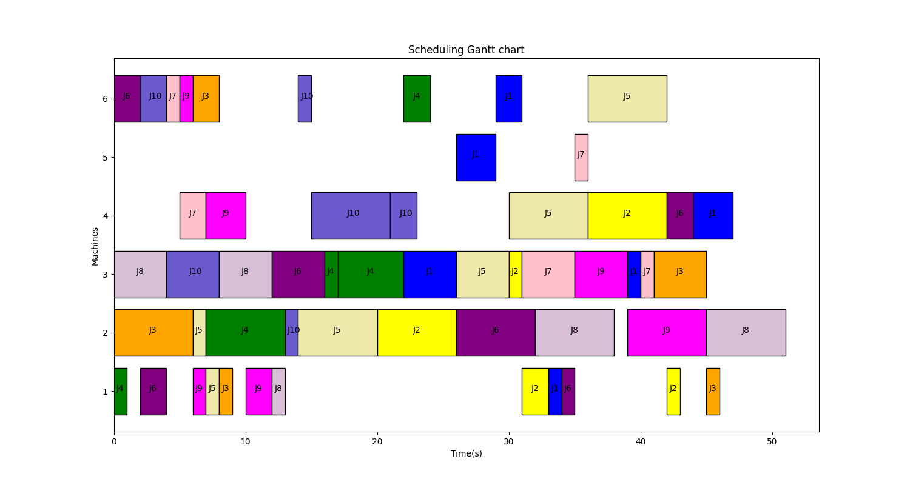
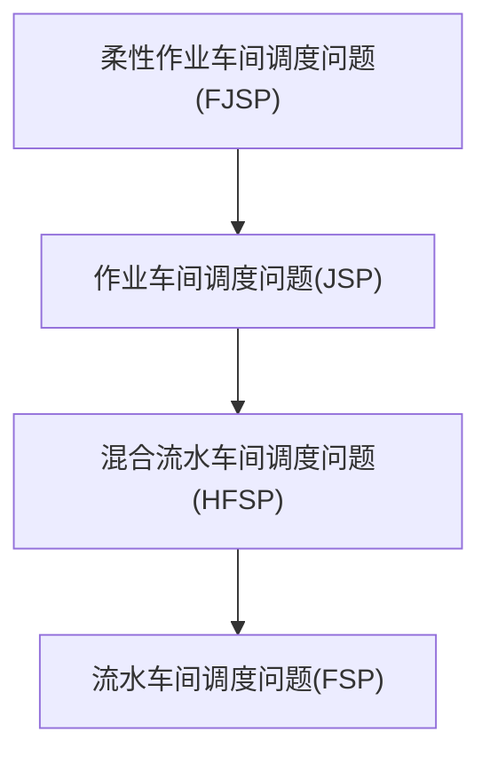

# Genetic Algorithm for Solving the Flexible Job-shop Scheduling Problem (FJSP)



**Flexible Job-shop Scheduling Problem (FJSP)** is an important optimization problem in the field of production scheduling. It is an extension of the classic Job-shop Scheduling Problem (JSP) and is more in line with the actual production needs. Here is a detailed introduction to FJSP:

1. **Problem Description**:
   - FJSP involves processing n jobs on m machines.
   - Each job consists of one or more operations (processes), and the sequence of these operations is predetermined.
   - Each operation can be processed on a set of given machines, and the processing time on different machines for the same operation may vary.
   - The goal of scheduling is to select the appropriate machine for each operation and determine the optimal processing order and start time for all operations on each machine to optimize certain performance indicators, such as minimizing the total completion time (makespan).
2. **Key Features**:
   - Unlike traditional JSP, FJSP allows each operation to be processed on multiple machines, increasing the flexibility of scheduling.
   - FJSP includes two sub-problems: machine selection (selecting the most suitable machine for each operation) and operation sequencing (determining the processing order on the machines).
3. **Constraints**:
   - The same machine can only process one job at a time.
   - The same operation of a job can only be processed by one machine at a time.
   - Once an operation starts, it cannot be interrupted.
   - Different jobs have the same priority.
   - There are no precedence constraints between operations of different jobs, but there are precedence constraints between operations of the same job.
   - All jobs can start processing at time zero.
4. **Solution Methods**:
   - Since FJSP is a typical NP-hard problem, finding the optimal solution is computationally complex. Therefore, researchers and practitioners usually seek heuristic or approximate solutions.
   - Common solution methods include heuristic algorithms (such as rule-based methods), metaheuristic algorithms (such as genetic algorithms, simulated annealing, particle swarm optimization, etc.), and machine learning techniques.
5. **Research Progress**:
   - Due to its practical application value in production, FJSP has always been a hot topic in domestic and foreign research.
   - Researchers are continuously exploring new solution methods and algorithms to improve the efficiency and quality of FJSP solutions.

### 1. Encoding:

The processing time, process, and machine are represented by a three-dimensional list. The first dimension represents 10 machines, the second dimension represents the number of processes for each machine, and the third dimension represents the number of machines available for processing and the time for each process on that machine. 9999 indicates that it cannot be processed on that machine:

```
Processing_time=[[[5, 9999, 4, 9999, 9999, 9999],
                  [9999, 1, 5, 9999, 3, 9999],
                  [9999, 9999, 4, 9999, 9999, 2],
                  [1, 6, 9999, 9999, 9999, 5],
                  [9999, 9999, 1, 9999, 9999, 9999],
                  [9999, 9999, 6, 3, 9999, 6]],

                 [[9999, 6, 9999, 9999, 9999, 9999],
                  [9999, 9999, 1, 9999, 9999, 9999],
                  [2, 9999, 9999, 9999, 9999, 9999],
                  [9999, 6, 9999, 6, 9999, 9999],
                  [1, 6, 9999, 9999, 9999, 5]],

                 [[9999, 6, 9999, 9999, 9999, 9999],
                  [9999, 9999, 4, 9999, 9999, 2],
                  [1, 6, 9999, 9999, 9999, 5],
                  [9999, 6, 4, 9999, 9999, 6],
                  [1, 9999, 9999, 9999, 5, 9999]],

                 [[1, 6, 9999, 9999, 9999, 5],
                  [9999, 6, 9999, 9999, 9999, 9999],
                  [9999, 9999, 1, 9999, 9999, 9999],
                  [9999, 1, 5, 9999, 3, 9999],
                  [9999, 9999, 4, 9999, 9999, 2]],

                 [[9999, 1, 5, 9999, 3, 9999],
                  [1, 6, 9999, 9999, 9999, 5],
                  [9999, 6, 9999, 9999, 9999, 9999],
                  [5, 9999, 4, 9999, 9999, 9999],
                  [9999, 6, 9999, 6, 9999, 9999],
                  [9999, 6, 4, 9999, 9999, 6]],

                 [[9999, 9999, 4, 9999, 9999, 2],
                  [2, 9999, 9999, 9999, 9999, 9999],
                  [9999, 6, 4, 9999, 9999, 6],
                  [9999, 6, 9999, 9999, 9999, 9999],
                  [1, 6, 9999, 9999, 9999, 5],
                  [3, 9999, 9999, 2, 9999, 9999]],

                 [[9999, 9999, 9999, 9999, 9999, 1],
                  [3, 9999, 9999, 2, 9999, 9999],
                  [9999, 6, 4, 9999, 9999, 6],
                  [6, 6, 9999, 9999, 1, 9999],
                  [9999, 9999, 1, 9999, 9999, 9999]],

                 [[9999, 9999, 4, 9999, 9999, 2],
                  [9999, 6, 4, 9999, 9999, 6],
                  [1, 6, 9999, 9999, 9999, 5],
                  [9999, 6, 9999, 9999, 9999, 9999],
                  [9999, 6, 9999, 6, 9999, 9999]],

                 [[9999, 9999, 9999, 9999, 9999, 1],
                  [1, 9999, 9999, 9999, 5, 9999],
                  [9999, 9999, 6, 3, 9999, 6],
                  [2, 9999, 9999, 9999, 9999, 9999],
                  [9999, 6, 4, 9999, 9999, 6],
                  [9999, 6, 9999, 6, 9999, 9999]],

                 [[9999, 9999, 4, 9999, 9999, 2],
                  [9999, 6, 4, 9999, 9999, 6],
                  [9999, 1, 5, 9999, 3, 9999],
                  [9999, 9999, 9999, 9999, 9999, 1],
                  [9999, 6, 9999, 6, 9999, 9999],
                  [3, 9999, 9999, 2, 9999, 9999]]]
```

**Machine Encoding**:

```
1,2,1,0,0,1,0,0,0,1,2,0,0,2,1,1,0,0,0,2,1,2,0,0,1,1,2,1,0,0,0,0,1,0,0,2,2,0,1,0,0,0,1,0,0,1,0,1,0,1,1,2,0,1,1
```

This sequence represents that the first operation of the first job is processed on the second available machine, the second operation of the first job is processed on the third available machine, the third operation of the first job is processed on the second available machine, and so on.

**Job Encoding**:

```
6,6,3,8,1,2,5,5,9,1,8,7,5,9,9,4,6,6,5,0,1,3,0,0,4,4,7,0,4,0,7,6,8,5,7,8,0,8,2,8,2,4,4,3,3,9,1,9,7,3,1,5,2,2,9 
```

This sequence indicates the order of operations to be scheduled, starting with the first operation of the seventh job, followed by the second operation of the seventh job, then the first operation of the fourth job, and so on.

### 2. Crossover

Crossover is divided into machine crossover and job crossover.

### 3. Mutation

Mutation is divided into machine mutation and job mutation.

### 4. Decoding

Decoding can be done based on machines and jobs, selecting the strategy with the highest fitness.

### 5. Experiments






# 遗传算法求解柔性作业车间调度问题FJSP



**柔性作业车间调度问题（Flexible Job-shop Scheduling Problem, FJSP）**是生产调度领域中一个重要的优化问题，它是经典作业车间调度问题（Job-shop Scheduling Problem, JSP）的扩展，更加符合实际生产的需求。以下是FJSP的详细介绍：

1. **问题描述**：
   - FJSP涉及将n个工件（Job）在m台机器上进行加工。
   - 每个工件包含一个或多个操作（工序），这些操作的顺序是预先确定的。
   - 每个操作可以在一组给定的机器上进行加工，不同的机器上加工同一操作的时间可能不同。
   - 调度的目标是为每个操作选择合适的机器，并确定每台机器上各个操作的最佳加工顺序及开始时间，以优化某些性能指标，如最小化总完工时间（makespan）。
2. **关键特点**：
   - 与传统的JSP不同，FJSP允许每个操作在多台机器上加工，增加了调度的灵活性。
   - FJSP包含两个子问题：机器选择（为每个操作选择最合适的机器）和操作排序（确定机器上的加工顺序）。
3. **约束条件**：
   - 同一台机器在某一时刻只能加工一个工件。
   - 同一工件的同一操作在同一时刻只能被一台机器加工。
   - 每个工件的每道操作一旦开始，加工就不能中断。
   - 不同工件之间具有相同的优先级。
   - 不同工件的操作之间没有先后约束，但同一工件的操作之间有先后约束。
   - 所有工件在零时刻都可以开始加工。
4. **求解方法**：
   - 由于FJSP是一个典型的NP-hard问题，寻找最优解在计算上非常复杂，因此研究者和实践者通常寻求启发式或近似解。
   - 常见的求解方法包括启发式算法（如基于规则的方法）、元启发式算法（如遗传算法、模拟退火、粒子群优化等）以及机器学习技术。
5. **研究进展**：
   - FJSP因其在实际生产中的应用价值，一直是国内外研究的热点。
   - 研究者们不断探索新的求解方法和算法，以提高FJSP解决方案的效率和质量

### 1、编码：

工件加工时间、工序、机器表示，三维列表第一维度表示10个机器，第二维度表示每个机器的工序数，第三维表示每个机器在该工序的可加工机器个数及时间，9999表示不可在该机器加工：

```
Processing_time=[[[5, 9999, 4, 9999, 9999, 9999],
                  [9999, 1, 5, 9999, 3, 9999],
                  [9999, 9999, 4, 9999, 9999, 2],
                  [1, 6, 9999, 9999, 9999, 5],
                  [9999, 9999, 1, 9999, 9999, 9999],
                  [9999, 9999, 6, 3, 9999, 6]],

                 [[9999, 6, 9999, 9999, 9999, 9999],
                  [9999, 9999, 1, 9999, 9999, 9999],
                  [2, 9999, 9999, 9999, 9999, 9999],
                  [9999, 6, 9999, 6, 9999, 9999],
                  [1, 6, 9999, 9999, 9999, 5]],

                 [[9999, 6, 9999, 9999, 9999, 9999],
                  [9999, 9999, 4, 9999, 9999, 2],
                  [1, 6, 9999, 9999, 9999, 5],
                  [9999, 6, 4, 9999, 9999, 6],
                  [1, 9999, 9999, 9999, 5, 9999]],

                 [[1, 6, 9999, 9999, 9999, 5],
                  [9999, 6, 9999, 9999, 9999, 9999],
                  [9999, 9999, 1, 9999, 9999, 9999],
                  [9999, 1, 5, 9999, 3, 9999],
                  [9999, 9999, 4, 9999, 9999, 2]],

                 [[9999, 1, 5, 9999, 3, 9999],
                  [1, 6, 9999, 9999, 9999, 5],
                  [9999, 6, 9999, 9999, 9999, 9999],
                  [5, 9999, 4, 9999, 9999, 9999],
                  [9999, 6, 9999, 6, 9999, 9999],
                  [9999, 6, 4, 9999, 9999, 6]],

                 [[9999, 9999, 4, 9999, 9999, 2],
                  [2, 9999, 9999, 9999, 9999, 9999],
                  [9999, 6, 4, 9999, 9999, 6],
                  [9999, 6, 9999, 9999, 9999, 9999],
                  [1, 6, 9999, 9999, 9999, 5],
                  [3, 9999, 9999, 2, 9999, 9999]],

                 [[9999, 9999, 9999, 9999, 9999, 1],
                  [3, 9999, 9999, 2, 9999, 9999],
                  [9999, 6, 4, 9999, 9999, 6],
                  [6, 6, 9999, 9999, 1, 9999],
                  [9999, 9999, 1, 9999, 9999, 9999]],

                 [[9999, 9999, 4, 9999, 9999, 2],
                  [9999, 6, 4, 9999, 9999, 6],
                  [1, 6, 9999, 9999, 9999, 5],
                  [9999, 6, 9999, 9999, 9999, 9999],
                  [9999, 6, 9999, 6, 9999, 9999]],

                 [[9999, 9999, 9999, 9999, 9999, 1],
                  [1, 9999, 9999, 9999, 5, 9999],
                  [9999, 9999, 6, 3, 9999, 6],
                  [2, 9999, 9999, 9999, 9999, 9999],
                  [9999, 6, 4, 9999, 9999, 6],
                  [9999, 6, 9999, 6, 9999, 9999]],

                 [[9999, 9999, 4, 9999, 9999, 2],
                  [9999, 6, 4, 9999, 9999, 6],
                  [9999, 1, 5, 9999, 3, 9999],
                  [9999, 9999, 9999, 9999, 9999, 1],
                  [9999, 6, 9999, 6, 9999, 9999],
                  [3, 9999, 9999, 2, 9999, 9999]]]
```

**机器编码：**

```
1,2,1,0,0,1,0,0,0,1,2,0,0,2,1,1,0,0,0,2,1,2,0,0,1,1,2,1,0,0,0,0,1,0,0,2,2,0,1,0,0,0,1,0,0,1,0,1,0,1,1,2,0,1,1
```

一系列序列表示第一个机器的第一个工序在第2个可加工机器上加工，第一个机器的第二个工序在第3个可加工机器上加工，第一个机器的第三个工序在第2个可加工机器上加工，第一个机器的第四个工序在第1个可加工机器上加工，第一个机器的第五个工序在第1个可加工机器上加工，第一个机器的第六个工序在第2个可加工机器上加工；第二个机器的第一个工序在第1个可加工机器上加工.................

**工件编码:**

```
6,6,3,8,1,2,5,5,9,1,8,7,5,9,9,4,6,6,5,0,1,3,0,0,4,4,7,0,4,0,7,6,8,5,7,8,0,8,2,8,2,4,4,3,3,9,1,9,7,3,1,5,2,2,9
```

一系列序列表示先安排第7个工件的第一个工序，然后是第7个工件的第二个工序，然后是第4个工件的第一个工序.......

### 2、交叉

分为机器交叉和工件交叉

### 3、变异

分为机器变异和工件变异

### 4、解码

也分为根据机器进行解码和根据工件进行解码，选取适应度最大的一个策略

### 5、实验


